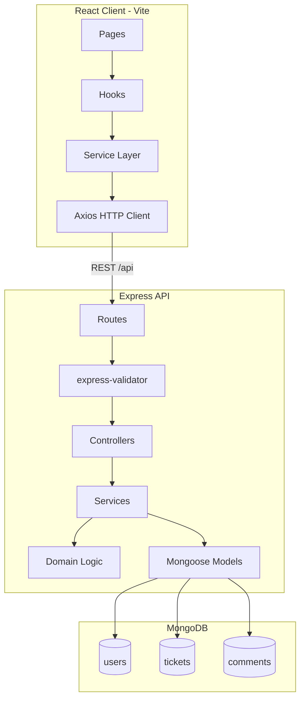

# Support Ticket Management System

A full-stack support ticket management application built with the MERN stack. Teams can create and manage tickets, track status through a defined lifecycle, search and filter tickets, and collaborate via comments.

## Project Overview

This project is a support ticket management system designed for internal or customer-facing help desks. It provides:

- **Ticket CRUD** with soft delete
- **Status lifecycle management** enforced by a server-side state machine
- **Comments** on tickets with author validation
- **Search and filtering** by keyword and status, with pagination
- **Dashboard** with status summaries and recent activity
- **React SPA** with loading states, error handling, and toast notifications

The backend follows a layered MVC architecture (routes → controllers → services → models) with centralized validation and error handling. The frontend uses a service layer and reusable hooks for API interaction.

## Architecture



### Request flow

1. The React app calls the API through `client/src/services/` (with optional retries on transient failures).
2. Express routes validate input via `express-validator` middleware.
3. Controllers delegate to service functions for business logic.
4. Services interact with Mongoose models and enforce rules (e.g. status transitions).
5. Errors are normalized by a global error handler into a consistent JSON envelope.

### Error response format

```json
{
  "error": {
    "code": "VALIDATION_ERROR",
    "message": "Validation failed",
    "details": {
      "title": "Title is required"
    }
  }
}
```

## Features

### Core

| Feature | Description |
|---------|-------------|
| Ticket CRUD | Create, read, update, and soft-delete tickets |
| Status state machine | `open → in_progress → resolved → closed`; `open/in_progress → cancelled` |
| Comments | List and add comments on active tickets |
| Search | Full-text search on title and description (case-insensitive) |
| Filtering | Filter tickets by status; combine with search |
| Pagination | Page/limit query params with total count metadata |
| Validation | Server-side field validation for tickets, comments, and queries |
| Error handling | Custom error classes, 404 handler, MongoDB error mapping |
| Dashboard | Status summary cards and recent tickets table |
| Seed data | Reusable script to populate demo users, tickets, and comments |

### Ticket status transitions

```
open        → in_progress, cancelled
in_progress → resolved, cancelled
resolved    → closed
closed      → (terminal)
cancelled   → (terminal)
```

Invalid transitions return `409 Conflict` with a descriptive message.

### Stretch (scaffolded, not implemented)

- JWT authentication and protected routes
- Role-based access control (RBAC)
- Login page UI stub at `/login`

## Installation

### Prerequisites

- **Node.js** 18+ (20+ recommended)
- **npm** 9+
- **MongoDB** 6+ running locally, or a MongoDB Atlas connection string

### Steps

1. **Clone the repository**

   ```bash
   git clone <repository-url>
   cd ticket-management-application
   ```

2. **Install server dependencies**

   ```bash
   cd server
   npm install
   ```

3. **Install client dependencies**

   ```bash
   cd ../client
   npm install
   ```

4. **Configure environment variables** (see below)

## Environment Variables

### Server (`server/.env`)

Copy the example file and adjust values as needed:

```bash
cd server
cp .env.example .env
```

| Variable | Required | Default | Description |
|----------|----------|---------|-------------|
| `PORT` | No | `5000` | API server port |
| `NODE_ENV` | No | `development` | Environment (`development`, `test`, `production`) |
| `MONGODB_URI` | **Yes** | — | MongoDB connection string |
| `CLIENT_URL` | No | `http://localhost:5173` | Allowed CORS origin |
| `JWT_SECRET` | No | — | JWT signing secret (stretch feature) |
| `JWT_EXPIRES_IN` | No | `24h` | JWT expiry (stretch feature) |

Example:

```env
PORT=5000
NODE_ENV=development
MONGODB_URI=mongodb://localhost:27017/ticket-management
CLIENT_URL=http://localhost:5173
```

### Client (`client/.env`)

```bash
cd client
cp .env.example .env
```

| Variable | Required | Default | Description |
|----------|----------|---------|-------------|
| `VITE_API_URL` | No | — | API base URL (optional; dev proxy handles `/api`) |

In development, Vite proxies `/api` requests to `http://localhost:5000`, so the client works without setting `VITE_API_URL`.

## Database Setup

1. **Start MongoDB** locally or use a cloud instance.

   ```bash
   # macOS (Homebrew)
   brew services start mongodb-community

   # Or run mongod directly
   mongod --dbpath /path/to/data
   ```

2. **Set `MONGODB_URI`** in `server/.env`:

   ```env
   MONGODB_URI=mongodb://localhost:27017/ticket-management
   ```

3. **Seed the database** with demo data:

   ```bash
   cd server
   npm run seed
   ```

   The seed script clears existing users, tickets, and comments, then inserts fresh demo data. It is safe to re-run during development.

MongoDB indexes are defined on the Mongoose schemas (text search on title/description, compound indexes for list queries). Indexes are created automatically when the server starts.

## Running Backend

```bash
cd server

# Development (with nodemon hot-reload)
npm run dev

# Production
npm start
```

The API runs at **http://localhost:5000**.

Health check: `GET http://localhost:5000/health`

### API base URL

```
http://localhost:5000/api
```

### Key endpoints

| Method | Path | Description |
|--------|------|-------------|
| `GET` | `/api/tickets` | List tickets (search, filter, paginate) |
| `POST` | `/api/tickets` | Create a ticket |
| `GET` | `/api/tickets/:id` | Get ticket with comments |
| `PATCH` | `/api/tickets/:id` | Update ticket fields |
| `PATCH` | `/api/tickets/:id/status` | Update ticket status |
| `DELETE` | `/api/tickets/:id` | Soft-delete a ticket |
| `GET` | `/api/tickets/:id/comments` | List comments |
| `POST` | `/api/tickets/:id/comments` | Add a comment |
| `GET` | `/api/users` | List users (for assignment dropdowns) |
| `GET` | `/api/users/:id` | Get user by ID |

See [`api-contract.md`](api-contract.md) for full request/response details.

## Running Frontend

```bash
cd client
npm run dev
```

The app runs at **http://localhost:5173**. API calls to `/api/*` are proxied to the backend.

### Production build

```bash
cd client
npm run build
npm run preview
```

### Routes

| Path | Page |
|------|------|
| `/` | Dashboard |
| `/tickets` | Ticket list with search and filters |
| `/tickets/new` | Create ticket |
| `/tickets/:id` | Ticket detail, status actions, comments |
| `/tickets/:id/edit` | Edit ticket |
| `/login` | Login stub (stretch) |

## Running Tests

### Backend (Jest + Supertest)

```bash
cd server
npm test

# Watch mode
npm run test:watch
```

Integration tests use an in-memory MongoDB instance (`mongodb-memory-server`). **173 tests** across unit and integration suites covering:

- CRUD operations
- Validation
- Comments
- Search and filtering
- Status state machine
- Error handling
- Seed script

### Frontend (Vitest + Testing Library)

```bash
cd client
npm test

# Watch mode
npm run test:watch
```

**14 tests** covering validation utilities, API error helpers, retry logic, debounce hook, and key UI components.

## Seed Data

Run from the `server` directory:

```bash
npm run seed
```

### Demo credentials

All seeded users share the same password:

| Email | Role | Password |
|-------|------|----------|
| `admin@demo.com` | admin | `Demo@1234` |
| `manager@demo.com` | manager | `Demo@1234` |
| `agent@demo.com` | agent | `Demo@1234` |
| `customer@demo.com` | customer | `Demo@1234` |

> Authentication is not wired up yet. These credentials are for reference and future auth implementation.

### Seeded content

| Collection | Count | Notes |
|------------|-------|-------|
| Users | 4 | One per role |
| Tickets | 8 | Mix of statuses and priorities |
| Comments | 6 | Threads on tickets T1–T4 |

Sample tickets include login issues, password reset, billing discrepancies, API timeouts, and mobile app crashes. Ticket T1 has a three-comment conversation thread.

The seed module is also importable for tests:

```js
import { seedDatabase } from './src/scripts/seed/seedDatabase.js';

const result = await seedDatabase({ clearExisting: true });
// result.usersByKey, result.ticketsByKey, result.commentsByKey
```

## Folder Structure

```
ticket-management-application/
├── README.md                    # This file
├── api-contract.md              # API specification
├── ui-flow.md                   # UI design notes
│
├── server/                      # Express API
│   ├── src/
│   │   ├── index.js             # Server entry point
│   │   ├── app.js               # Express app (importable for tests)
│   │   ├── config/              # Environment and database connection
│   │   ├── constants/           # Statuses, priorities, roles, pagination
│   │   ├── controllers/         # HTTP request handlers
│   │   ├── domain/              # Pure business rules (state machine, query builder)
│   │   ├── errors/              # Custom error classes and codes
│   │   ├── middleware/          # Validation, auth stub, error handler, logging
│   │   ├── models/              # Mongoose schemas (User, Ticket, Comment)
│   │   ├── routes/              # Route definitions
│   │   ├── services/            # Business logic layer
│   │   ├── utils/               # Logger, pagination, async handler
│   │   ├── validators/          # express-validator chains
│   │   └── scripts/seed/        # Seed data and CLI script
│   ├── tests/
│   │   ├── unit/                # Domain logic, models, error classes
│   │   ├── integration/         # API tests with in-memory MongoDB
│   │   └── helpers/             # Test environment setup
│   ├── .env.example
│   └── package.json
│
├── client/                      # React SPA (Vite)
│   ├── src/
│   │   ├── api/                 # Low-level Axios endpoint wrappers
│   │   ├── services/            # Service layer with retry support
│   │   ├── hooks/               # useTickets, useTicket, useMutation, etc.
│   │   ├── pages/               # Route-level page components
│   │   ├── components/          # UI components (tickets, comments, common)
│   │   ├── context/             # Toast and auth context
│   │   ├── routes/              # React Router configuration
│   │   ├── layouts/             # App shell layout
│   │   ├── utils/               # Validation and error helpers
│   │   └── constants/           # Frontend status labels
│   ├── .env.example
│   └── package.json
│
└── database/                    # Schema and seed documentation
    ├── schema/
    └── seed-data/
```

## Known Limitations

| Area | Limitation |
|------|------------|
| **Authentication** | No JWT login or session management. All API endpoints are publicly accessible. Login page and auth middleware are scaffolded only. |
| **Authorization / RBAC** | User roles exist in the data model but are not enforced on API routes or UI actions. |
| **Real-time updates** | No WebSockets or polling. Users must refresh to see changes from others. |
| **File attachments** | Tickets and comments are text-only; no file upload support. |
| **Audit trail** | Status changes and edits are not logged in a separate history collection. |
| **Email notifications** | No outbound email on ticket creation, assignment, or status change. |
| **Bulk operations** | No bulk update, delete, or export endpoints. |
| **Soft-deleted tickets** | Deleted tickets are hidden from all queries with no admin restore UI. |
| **Search** | Full-text search requires a MongoDB text index. Special characters in search terms fall back to regex matching. |
| **Client env** | Production deployments must set `VITE_API_URL` or configure a reverse proxy; the dev proxy is not available in production builds. |
| **Password security** | Seeded passwords are bcrypt-hashed, but without auth the hashing is unused at runtime. |

## Tech Stack

| Layer | Technology |
|-------|------------|
| Database | MongoDB with Mongoose ODM |
| Backend | Node.js, Express, express-validator |
| Frontend | React 18, React Router, Vite |
| HTTP client | Axios with retry wrapper |
| Testing | Jest, Supertest, Vitest, Testing Library |
| Dev tools | nodemon, mongodb-memory-server |

## Documentation Index

| Document | Description |
|----------|-------------|
| [`api-contract.md`](api-contract.md) | REST API request/response contracts |
| [`ui-flow.md`](ui-flow.md) | UI pages and user flows |
| [`server/README.md`](server/README.md) | Server-specific setup notes |
| [`client/README.md`](client/README.md) | Client-specific setup notes |
| [`database/schema/README.md`](database/schema/README.md) | Database schema documentation |
| [`database/seed-data/README.md`](database/seed-data/README.md) | Seed data reference |

## License

ISC
