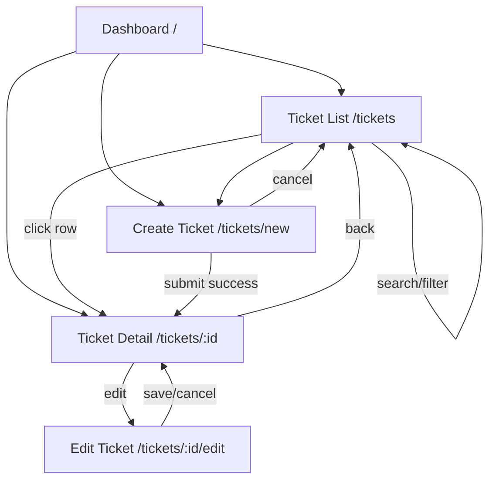

# UI Flow — Frontend Design

> React SPA frontend design for the Support Ticket Management System.
> Stack: React 18 · Vite · React Router 6 · Axios
> API reference: [`api-contract.md`](./api-contract.md)

---

## Table of Contents

1. [Overview](#1-overview)
2. [Pages](#2-pages)
3. [Navigation](#3-navigation)
4. [User Flows](#4-user-flows)
5. [Component Hierarchy](#5-component-hierarchy)
6. [State Management](#6-state-management)
7. [Search](#7-search)
8. [Status Update](#8-status-update)
9. [Comment Section](#9-comment-section)
10. [Loading UI](#10-loading-ui)
11. [Error UI](#11-error-ui)
12. [Responsive Design](#12-responsive-design)
13. [Accessibility](#13-accessibility)
14. [Route Map](#14-route-map)

---

## 1. Overview

### Design Principles

| Principle | Application |
|-----------|-------------|
| Server is authoritative | UI mirrors allowed status transitions; server enforces via 409 |
| Page owns data; component owns presentation | Pages use hooks; components receive props |
| Four states everywhere | loading · empty · error · success on every async view |
| Progressive disclosure | Detail page shows full context; list shows summary |
| No optimistic updates | Wait for server response before updating UI |
| Mobile-first responsive | Layout adapts from 320px to 1440px |

### Tech Stack

| Layer | Choice |
|-------|--------|
| Framework | React 18 (functional components + hooks) |
| Build | Vite |
| Routing | React Router 6 |
| HTTP | Axios via `api/` wrappers |
| Styling | CSS Modules or Tailwind (pick one, stay consistent) |
| State | Local state + custom hooks (no Redux) |

---

## 2. Pages

### 2.1 Dashboard

| | |
|---|---|
| **Route** | `/` |
| **Page component** | `DashboardPage` |
| **Purpose** | Landing page with ticket summary stats and quick navigation |

#### Layout

```
┌─────────────────────────────────────────────────────┐
│  Navbar                                              │
├─────────────────────────────────────────────────────┤
│  Dashboard                                           │
│                                                      │
│  ┌──────────┐ ┌──────────┐ ┌──────────┐ ┌─────────┐ │
│  │ Open     │ │ In Prog  │ │ Resolved │ │ Closed  │ │
│  │   4      │ │    1     │ │    1     │ │    1    │ │
│  └──────────┘ └──────────┘ └──────────┘ └─────────┘ │
│                                                      │
│  Recent Tickets (last 5)          [View All →]       │
│  ┌───────────────────────────────────────────────┐   │
│  │ Title          Status    Priority   Assignee  │   │
│  │ Cannot login   open     high       Bob Agent  │   │
│  │ ...                                           │   │
│  └───────────────────────────────────────────────┘   │
│                                                      │
│  [ + Create Ticket ]                                 │
└─────────────────────────────────────────────────────┘
```

#### Data Sources

| Widget | API Call |
|--------|----------|
| Status count cards | `GET /api/tickets` — count by status client-side |
| Recent tickets table | `GET /api/tickets` — slice first 5 by `createdAt` desc |

#### Interactions

| Action | Result |
|--------|--------|
| Click status card | Navigate to `/tickets?status={status}` |
| Click "View All" | Navigate to `/tickets` |
| Click recent ticket row | Navigate to `/tickets/:id` |
| Click "Create Ticket" | Navigate to `/tickets/new` |

#### States

| State | UI |
|-------|-----|
| Loading | Skeleton cards + skeleton table rows |
| Error | `ErrorAlert` with retry button |
| Empty (no tickets) | Empty state with "Create your first ticket" CTA |
| Success | Populated cards and table |

---

### 2.2 Ticket List

| | |
|---|---|
| **Route** | `/tickets` |
| **Page component** | `TicketListPage` |
| **Purpose** | Browse, search, and filter all tickets |

#### Layout

```
┌─────────────────────────────────────────────────────┐
│  Navbar                                              │
├─────────────────────────────────────────────────────┤
│  Tickets                         [ + Create Ticket ] │
│                                                      │
│  ┌─────────────────────┐  ┌────────────────────┐    │
│  │ 🔍 Search tickets...│  │ Status: All    ▾  │    │
│  └─────────────────────┘  └────────────────────┘    │
│                                                      │
│  Showing 4 of 8 tickets                              │
│  ┌───────────────────────────────────────────────┐   │
│  │ Title       Status   Priority  Assignee  Date │   │
│  │ Cannot login open    high      Bob      Jan15│   │
│  │ Password... in_prog  medium    Bob      Jan14│   │
│  └───────────────────────────────────────────────┘   │
└─────────────────────────────────────────────────────┘
```

#### Columns

| Column | Source | Notes |
|--------|--------|-------|
| Title | `ticket.title` | Truncate at 60 chars on mobile |
| Status | `ticket.status` | `StatusBadge` component |
| Priority | `ticket.priority` | `PriorityBadge` component |
| Assignee | `ticket.assignedTo?.name` | "Unassigned" if null |
| Created | `ticket.createdAt` | Relative date ("2 days ago") |

#### Interactions

| Action | Result |
|--------|--------|
| Type in search | Debounced 300ms → update URL `?search=` → refetch |
| Change status filter | Immediate → update URL `?status=` → refetch |
| Click row | Navigate to `/tickets/:id` |
| Click "Create Ticket" | Navigate to `/tickets/new` |

#### URL Sync

Search and filter state is reflected in the URL for bookmarkability:

```
/tickets
/tickets?status=open
/tickets?search=login
/tickets?search=API&status=open
```

---

### 2.3 Create Ticket

| | |
|---|---|
| **Route** | `/tickets/new` |
| **Page component** | `CreateTicketPage` |
| **Purpose** | Submit a new support ticket |

#### Layout

```
┌─────────────────────────────────────────────────────┐
│  Navbar                                              │
├─────────────────────────────────────────────────────┤
│  ← Back to Tickets                                   │
│                                                      │
│  Create Ticket                                       │
│  ┌───────────────────────────────────────────────┐   │
│  │ Title *                                       │   │
│  │ [________________________________]            │   │
│  │                                               │   │
│  │ Description *                                 │   │
│  │ [________________________________]            │   │
│  │ [________________________________]            │   │
│  │                                               │   │
│  │ Priority                                      │   │
│  │ ( ) Low  (•) Medium  ( ) High                 │   │
│  │                                               │   │
│  │ Created By *                                  │   │
│  │ [ Alice Customer          ▾ ]                 │   │
│  │                                               │   │
│  │ Assign To (optional)                          │   │
│  │ [ Bob Agent               ▾ ]                 │   │
│  │                                               │   │
│  │         [ Cancel ]  [ Create Ticket ]         │   │
│  └───────────────────────────────────────────────┘   │
└─────────────────────────────────────────────────────┘
```

#### Form Fields

| Field | Type | Required | API Field |
|-------|------|----------|-----------|
| Title | text input | yes | `title` |
| Description | textarea | yes | `description` |
| Priority | radio/select | no (default medium) | `priority` |
| Created By | user dropdown | yes | `createdBy` |
| Assign To | user dropdown | no | `assignedTo` |

> `createdBy` dropdown populated from `GET /api/users`. In stretch auth mode, field is hidden and set from logged-in user.

#### Submit Flow

```
1. Client validation (inline errors)
2. Disable submit button → show spinner
3. POST /api/tickets
4. On 201 → navigate to /tickets/:id with success toast
5. On 400 → show field errors from error.details
6. On error → show ErrorAlert, re-enable submit
```

#### Cancel

Navigate back to `/tickets` without saving.

---

### 2.4 Ticket Detail

| | |
|---|---|
| **Route** | `/tickets/:id` |
| **Page component** | `TicketDetailPage` |
| **Purpose** | View full ticket context: metadata, status actions, comments |

#### Layout

```
┌─────────────────────────────────────────────────────┐
│  Navbar                                              │
├─────────────────────────────────────────────────────┤
│  ← Back to Tickets          [ Edit ] [ Delete† ]    │
│                                                      │
│  Cannot login to account                             │
│  ┌─────────┐ ┌──────────┐                           │
│  │  OPEN   │ │  HIGH    │                           │
│  └─────────┘ └──────────┘                           │
│                                                      │
│  ┌─ Details ─────────────────────────────────────┐   │
│  │ Description: Getting 401 error since...       │   │
│  │ Created by:  Alice Customer    Jan 15, 2026   │   │
│  │ Assigned to: Bob Agent                          │   │
│  │ Last updated: Jan 15, 2026 12:00              │   │
│  └───────────────────────────────────────────────┘   │
│                                                      │
│  ┌─ Status Actions ──────────────────────────────┐   │
│  │ [ Start Progress ]  [ Cancel Ticket ]         │   │
│  └───────────────────────────────────────────────┘   │
│                                                      │
│  ┌─ Comments (3) ───────────────────────────────┐   │
│  │ Bob Agent · Jan 15, 11:00                     │   │
│  │ I've unlocked your account...                 │   │
│  │ ─────────────────────────────────────────     │   │
│  │ Alice Customer · Jan 15, 11:30                │   │
│  │ Thanks! Login works now.                      │   │
│  │ ─────────────────────────────────────────     │   │
│  │ [ Add a comment...              ] [ Post ]    │   │
│  └───────────────────────────────────────────────┘   │
└─────────────────────────────────────────────────────┘
† Delete out of core scope
```

#### Data Source

`GET /api/tickets/:id` — returns ticket with `comments[]` and `allowedNextStatuses[]`.

#### Sections on Page

| Section | Component | Description |
|---------|-----------|-------------|
| Header | `TicketDetailHeader` | Title, status badge, priority badge, edit button |
| Details | `TicketMetadata` | Description, created by, assignee, dates |
| Status Actions | `StatusActions` | Transition buttons (see [Status Update](#8-status-update)) |
| Comments | `CommentSection` | Thread + form (see [Comment Section](#9-comment-section)) |

#### Interactions

| Action | Result |
|--------|--------|
| Click "Edit" | Navigate to `/tickets/:id/edit` |
| Click "Back" | Navigate to `/tickets` |
| Click status action button | Status update flow (see §8) |
| Submit comment | Comment flow (see §9) |

---

### 2.5 Edit Ticket

| | |
|---|---|
| **Route** | `/tickets/:id/edit` |
| **Page component** | `EditTicketPage` |
| **Purpose** | Update title, description, priority, and assignee |

#### Layout

Same form as Create Ticket, pre-populated with existing values.

```
┌─────────────────────────────────────────────────────┐
│  ← Back to Ticket                                    │
│                                                      │
│  Edit Ticket                                         │
│  ┌───────────────────────────────────────────────┐   │
│  │ Title *        [Cannot login to account    ]  │   │
│  │ Description *  [Getting 401 error...       ]  │   │
│  │ Priority       ( ) Low ( ) Med (•) High       │   │
│  │ Assign To      [ Bob Agent              ▾ ]   │   │
│  │                                               │   │
│  │ Status: OPEN (read-only — use detail page)   │   │
│  │                                               │   │
│  │         [ Cancel ]  [ Save Changes ]          │   │
│  └───────────────────────────────────────────────┘   │
└─────────────────────────────────────────────────────┘
```

#### Design Decision: Status Not Editable Here

Status changes are isolated to the **Status Actions** section on the Detail page via `PATCH /api/tickets/:id/status`. The edit form handles only mutable fields: title, description, priority, assignedTo.

**Why:** Separates field edits from governed lifecycle transitions; prevents accidental status bypass.

#### Submit Flow

```
1. Client validation
2. PATCH /api/tickets/:id { title, description, priority, assignedTo }
3. On 200 → navigate to /tickets/:id with success toast
4. On 400/404 → show errors
```

#### Reassign

Changing "Assign To" dropdown and saving sends `assignedTo` in the PATCH body. Setting to "Unassigned" sends `assignedTo: null`.

---

## 3. Navigation

### 3.1 Navbar

Persistent across all authenticated pages.

```
┌──────────────────────────────────────────────────────────┐
│  🎫 TicketManager   Dashboard   Tickets   [+ New]  👤   │
└──────────────────────────────────────────────────────────┘
```

| Link | Route | Active When |
|------|-------|-------------|
| Logo / App name | `/` | — |
| Dashboard | `/` | pathname === `/` |
| Tickets | `/tickets` | pathname starts with `/tickets` |
| + New Ticket | `/tickets/new` | — |
| User menu (stretch) | — | Login/logout |

### 3.2 Breadcrumbs (Detail and Edit)

```
Tickets  >  Cannot login to account
Tickets  >  Cannot login to account  >  Edit
```

### 3.3 Navigation Map



### 3.4 Protected Routes (Stretch)

| Route | Guard |
|-------|-------|
| All except `/login` | Redirect to `/login` if no token |
| `/login` | Redirect to `/` if already authenticated |

---

## 4. User Flows

### Flow 1: First Visit → Dashboard

```
Land on / → Dashboard loads → see status summary + recent tickets
```

### Flow 2: Browse and Search Tickets

```
Dashboard → click "View All" or "Tickets" nav
→ Ticket List loads
→ type "login" in search (debounced)
→ list filters to matching tickets
→ select "open" from status dropdown
→ list shows open tickets matching "login"
→ click a row → Ticket Detail
```

### Flow 3: Create a Ticket

```
Any page → click "+ Create Ticket"
→ Create Ticket form
→ fill title, description, priority
→ select createdBy from dropdown
→ optionally select assignee
→ click "Create Ticket"
→ POST /api/tickets → redirect to Ticket Detail
```

### Flow 4: View Ticket Detail

```
Ticket List → click row
→ GET /api/tickets/:id
→ see metadata, status badges, allowed action buttons, comment thread
```

### Flow 5: Edit a Ticket

```
Ticket Detail → click "Edit"
→ Edit Ticket form (pre-populated)
→ change title / description / priority / assignee
→ click "Save Changes"
→ PATCH /api/tickets/:id → redirect to Ticket Detail
```

### Flow 6: Update Status

```
Ticket Detail → Status Actions section
→ click "Start Progress" (open → in_progress)
→ PATCH /api/tickets/:id/status { status: "in_progress" }
→ on 200: badge updates, action buttons refresh
→ on 409: ErrorAlert shows server message with allowed transitions
```

### Flow 7: Add a Comment

```
Ticket Detail → Comment Section
→ type in comment box
→ click "Post"
→ POST /api/tickets/:id/comments
→ on 201: comment appended to thread, form cleared
→ on 400: inline error on comment field
```

### Flow 8: Reassign on Edit Page

```
Ticket Detail → Edit
→ change "Assign To" dropdown to different agent
→ Save → PATCH with new assignedTo
→ Detail page shows updated assignee
```

### Flow 9: Unassign a Ticket

```
Edit Ticket → set "Assign To" to "Unassigned"
→ Save → PATCH { assignedTo: null }
→ Detail shows "Unassigned"
```

---

## 5. Component Hierarchy

```
App
├── Router
│   ├── Layout
│   │   ├── Navbar
│   │   │   ├── NavLink (Dashboard)
│   │   │   ├── NavLink (Tickets)
│   │   │   ├── Button (Create Ticket)
│   │   │   └── UserMenu (stretch)
│   │   ├── Breadcrumbs (detail/edit pages)
│   │   └── Outlet (page content)
│   │
│   ├── DashboardPage
│   │   ├── PageHeader
│   │   ├── StatusSummaryCards
│   │   │   └── StatusCard (×5, one per status)
│   │   ├── RecentTicketsTable
│   │   │   └── TicketRow
│   │   ├── LoadingSkeleton
│   │   ├── EmptyState
│   │   └── ErrorAlert
│   │
│   ├── TicketListPage
│   │   ├── PageHeader
│   │   │   └── Button (Create Ticket)
│   │   ├── SearchAndFilter
│   │   │   ├── SearchBar
│   │   │   └── StatusFilter
│   │   ├── ResultsCount
│   │   ├── TicketTable
│   │   │   ├── TicketTableHeader
│   │   │   └── TicketRow (×n)
│   │   │       ├── StatusBadge
│   │   │       └── PriorityBadge
│   │   ├── LoadingSkeleton
│   │   ├── EmptyState
│   │   └── ErrorAlert
│   │
│   ├── CreateTicketPage
│   │   ├── BackLink
│   │   ├── PageHeader
│   │   └── TicketForm (mode="create")
│   │       ├── FormField (title)
│   │       ├── FormField (description)
│   │       ├── PrioritySelector
│   │       ├── UserSelect (createdBy)
│   │       ├── UserSelect (assignedTo)
│   │       ├── FormErrorSummary
│   │       └── FormActions (Cancel / Submit)
│   │
│   ├── TicketDetailPage
│   │   ├── BackLink
│   │   ├── TicketDetailHeader
│   │   │   ├── StatusBadge
│   │   │   ├── PriorityBadge
│   │   │   └── Button (Edit)
│   │   ├── TicketMetadata
│   │   ├── StatusActions
│   │   │   └── StatusButton (×n, one per allowed transition)
│   │   ├── StatusUpdateError (inline 409 alert)
│   │   ├── CommentSection
│   │   │   ├── CommentList
│   │   │   │   └── CommentItem (×n)
│   │   │   └── CommentForm
│   │   ├── LoadingSkeleton
│   │   └── ErrorAlert
│   │
│   ├── EditTicketPage
│   │   ├── BackLink
│   │   ├── PageHeader
│   │   ├── ReadOnlyStatusBadge
│   │   └── TicketForm (mode="edit")
│   │
│   └── LoginPage (stretch)
│       └── LoginForm
│
└── Toast / Notification (global success messages)
```

### Component Responsibility Matrix

| Component | Type | Props In | Events Out |
|-----------|------|----------|------------|
| `Layout` | container | children | — |
| `Navbar` | layout | currentUser (stretch) | onLogout |
| `SearchBar` | controlled input | value, placeholder | onChange (debounced) |
| `StatusFilter` | select | value, options | onChange |
| `TicketTable` | display | tickets[], onRowClick | onRowClick(id) |
| `TicketRow` | display | ticket | onClick |
| `StatusBadge` | display | status | — |
| `PriorityBadge` | display | priority | — |
| `TicketForm` | form | mode, initialValues, users[] | onSubmit, onCancel |
| `UserSelect` | select | users[], value, label | onChange |
| `StatusActions` | actions | allowedNextStatuses[] | onTransition(status) |
| `StatusButton` | button | status, label, loading | onClick |
| `CommentList` | display | comments[] | — |
| `CommentItem` | display | comment | — |
| `CommentForm` | form | loading, error | onSubmit(body) |
| `ErrorAlert` | feedback | message, onRetry? | onRetry |
| `LoadingSkeleton` | feedback | variant (card/table/form) | — |
| `EmptyState` | feedback | title, message, action | onAction |
| `Toast` | feedback | message, type | — |

---

## 6. State Management

### Strategy

**Local component state + custom hooks.** No Redux or global store.

| Scope | Mechanism | Example |
|-------|-----------|---------|
| Page data | Custom hook | `useTickets({ search, status })` |
| Single resource | Custom hook | `useTicket(id)` |
| Form state | `useState` in form component | field values, touched, errors |
| URL state | React Router search params | `?search=login&status=open` |
| Auth (stretch) | React Context | `AuthContext` with user + token |
| Global toasts | React Context or callback | `ToastContext` |

### Custom Hooks

#### `useTickets({ search, status })`

| Returns | Type | Description |
|---------|------|-------------|
| `tickets` | array | Ticket list |
| `total` | number | Result count |
| `loading` | boolean | Fetch in progress |
| `error` | string \| null | Error message |
| `refetch` | function | Manual re-fetch |

Triggers `GET /api/tickets?search=&status=` on mount and when params change.

#### `useTicket(id)`

| Returns | Type | Description |
|---------|------|-------------|
| `ticket` | object \| null | Ticket with comments + allowedNextStatuses |
| `loading` | boolean | Fetch in progress |
| `error` | string \| null | Error message |
| `refetch` | function | Re-fetch after status change or comment |

Triggers `GET /api/tickets/:id` on mount and when `id` changes.

#### `useUsers()`

| Returns | Type | Description |
|---------|------|-------------|
| `users` | array | All seeded users |
| `loading` | boolean | Fetch in progress |
| `error` | string \| null | Error message |

Triggers `GET /api/users` on mount. Cached for session (no refetch on every form open).

#### `useDebounce(value, delay)`

Generic debounce hook used by `SearchBar` (300ms delay).

### State Flow Diagram

```
URL search params
      │
      ▼
useTickets({ search, status })
      │
      ├── loading: true  → LoadingSkeleton
      ├── error: string  → ErrorAlert
      ├── tickets: []    → EmptyState
      └── tickets: [...]  → TicketTable
```

### Form State Pattern

```
field values (useState)
field errors (useState, set on blur + submit)
isSubmitting (useState, true during API call)
submitError (useState, from API error response)

onSubmit:
  1. validate locally
  2. if invalid → set field errors, return
  3. set isSubmitting true
  4. call API
  5. on success → navigate or callback
  6. on error → set submitError / field errors from details
  7. set isSubmitting false
```

### Why No Global Store

| Reason | Explanation |
|--------|-------------|
| Scope is small | 5 pages, no shared complex state across distant components |
| URL is the list state | Search and filter live in URL params, not store |
| Hooks are sufficient | `useTickets` and `useTicket` encapsulate async state cleanly |
| Assessment simplicity | Fewer dependencies, easier to explain in reflection |

---

## 7. Search

### Location

Search lives on the **Ticket List** page (`/tickets`). Dashboard links to filtered list views.

### Components

| Component | Role |
|-----------|------|
| `SearchBar` | Text input with search icon; debounced onChange |
| `StatusFilter` | Dropdown: All / open / in_progress / resolved / closed / cancelled |
| `ResultsCount` | "Showing X of Y tickets" label |

### Behaviour

| Event | Action |
|-------|--------|
| User types in search | Debounce 300ms → update `?search=` in URL → `useTickets` refetches |
| User clears search | Remove `search` param → show all (respecting status filter) |
| User changes status filter | Update `?status=` immediately → refetch |
| User lands on `/tickets?search=login` | Hook reads URL params on mount → fetches with search |
| No results | `EmptyState`: "No tickets match your search" with clear-filters button |

### API Mapping

```
GET /api/tickets?search={query}&status={status}
```

### Clear Filters

Button resets URL to `/tickets` (removes all query params) and refetches.

---

## 8. Status Update

### Location

**Ticket Detail page** — `StatusActions` section below metadata.

### Components

| Component | Role |
|-----------|------|
| `StatusActions` | Container; renders one `StatusButton` per allowed transition |
| `StatusButton` | Labelled button for a single transition; shows spinner when loading |
| `StatusUpdateError` | Inline alert for 409 errors; dismissible |

### Button Labels

| Transition | Button Label | Variant |
|------------|-------------|---------|
| `open → in_progress` | Start Progress | primary |
| `open → cancelled` | Cancel Ticket | danger |
| `in_progress → resolved` | Mark Resolved | primary |
| `resolved → closed` | Close Ticket | success |
| terminal states | *(no buttons rendered)* | — |

### Allowed Buttons Source

Priority order:
1. `ticket.allowedNextStatuses` from API response (preferred)
2. Fallback: `allowedNextStatuses(ticket.status)` from `constants/ticketStatus.js`

### Interaction Flow

```
1. User clicks "Start Progress"
2. StatusButton shows spinner; all buttons disabled
3. PATCH /api/tickets/:id/status { status: "in_progress" }
4. On 200:
   - refetch ticket (updates badge, buttons, allowedNextStatuses)
   - show success toast "Status updated to In Progress"
5. On 409:
   - show StatusUpdateError with server message
   - re-enable buttons
6. On 404:
   - show ErrorAlert; offer navigate back to list
```

### No Confirmation Modal (Core)

Single-click transition for assessment simplicity. Optional confirmation modal for `cancelled` and `closed` as stretch enhancement.

---

## 9. Comment Section

### Location

Bottom of **Ticket Detail** page.

### Components

| Component | Role |
|-----------|------|
| `CommentSection` | Wrapper with heading "Comments (N)" |
| `CommentList` | Scrollable list of `CommentItem` |
| `CommentItem` | Author name, relative timestamp, body text |
| `CommentForm` | Textarea + Post button |

### Layout

```
Comments (3)
─────────────────────────────────
Bob Agent · 30 minutes ago
I've unlocked your account. Please try again.

Alice Customer · 15 minutes ago
Thanks! Login works now.
─────────────────────────────────
┌────────────────────────────────┐
│ Add a comment...               │
└────────────────────────────────┘
                              [ Post ]
```

### Data

- Loaded as part of `GET /api/tickets/:id` → `ticket.comments[]`
- Sorted ascending by `createdAt` (oldest first)

### Add Comment Flow

```
1. User types in textarea
2. "Post" disabled when body is empty (after trim)
3. Click Post → isSubmitting true
4. POST /api/tickets/:id/comments { body, authorId }
5. On 201:
   - append new comment to local list (or refetch ticket)
   - clear textarea
   - show success toast
6. On 400: inline error below textarea
7. On 404: ErrorAlert "Ticket not found"
```

### Author Selection (Core — No Auth)

Small dropdown above textarea to select `authorId` from seeded users. Hidden in stretch auth mode (uses logged-in user).

### Allowed on All Statuses

Comments can be added on tickets in any status including `closed` and `cancelled`.

---

## 10. Loading UI

### Patterns

| Context | Loading UI |
|---------|-----------|
| Dashboard cards | 5 skeleton cards (pulsing rectangles) |
| Ticket table | 5 skeleton rows with column placeholders |
| Ticket detail | Skeleton for header + metadata block |
| Form submit | Disabled button with inline spinner; form fields disabled |
| Status button click | Spinner inside clicked button; sibling buttons disabled |
| Comment post | "Post" button shows spinner; textarea disabled |
| Full page initial load | Centered spinner only if no layout shell yet |

### Skeleton Guidelines

- Use grey pulsing placeholders matching final layout dimensions
- Show skeleton only on **initial** load, not on refetch (use subtle opacity fade for refetch)
- Minimum display time: none (show immediately)

### Button Loading States

| Button | Loading Appearance |
|--------|-------------------|
| Create Ticket | "Creating..." + spinner |
| Save Changes | "Saving..." + spinner |
| Status action | Spinner replaces label |
| Post comment | "Posting..." + spinner |

---

## 11. Error UI

### Error Types and UI Mapping

| Error | Source | UI Component | Location |
|-------|--------|-------------|----------|
| Page load failure | GET 500/ network | `ErrorAlert` | Top of page content |
| 404 ticket | GET 404 | `ErrorAlert` + back link | Replaces page content |
| Validation (form) | POST/PATCH 400 | Inline field errors | Below each field |
| Validation summary | POST/PATCH 400 | `FormErrorSummary` | Top of form |
| Invalid transition | PATCH 409 | `StatusUpdateError` | Below StatusActions |
| Comment validation | POST 400 | Inline below textarea | CommentForm |
| Search no results | GET 200 empty | `EmptyState` | Replaces table |
| Network offline | fetch error | `ErrorAlert` | "Unable to connect. Check your network." |

### ErrorAlert Component

```
┌─────────────────────────────────────────────────┐
│  ⚠  Unable to load tickets.                     │
│     An unexpected error occurred.               │
│                              [ Try Again ]        │
└─────────────────────────────────────────────────┘
```

| Prop | Type | Description |
|------|------|-------------|
| `message` | string | Primary error message (from `error.message`) |
| `onRetry` | function? | Refetch callback; omit if not recoverable |

### 409 Status Update Error

```
┌─────────────────────────────────────────────────┐
│  ⚠  Invalid status transition: open → closed.   │
│     Allowed from open: in_progress, cancelled   │
│                                          [ ✕ ]    │
└─────────────────────────────────────────────────┘
```

Displayed inline below status buttons. Dismissible. Does not replace the whole page.

### Toast (Success)

```
┌──────────────────────────┐
│  ✓  Ticket created       │
└──────────────────────────┘
```

Auto-dismiss after 3 seconds. Used for: create success, save success, status update success, comment posted.

### Error Message Priority

1. `error.details[field]` — field-specific (400)
2. `error.message` — server message (409, 404, 500)
3. Generic fallback — "Something went wrong. Please try again."

---

## 12. Responsive Design

### Breakpoints

| Name | Width | Layout |
|------|-------|--------|
| Mobile | < 640px | Single column; stacked cards |
| Tablet | 640–1024px | Two-column dashboard cards; condensed table |
| Desktop | > 1024px | Full layout as designed |

### Page Adaptations

#### Dashboard

| Breakpoint | Behaviour |
|------------|-----------|
| Mobile | Status cards 2×2 grid; recent tickets as card list (not table) |
| Tablet | Status cards 5 across (scroll if needed) |
| Desktop | Full 5-card row + table |

#### Ticket List

| Breakpoint | Behaviour |
|------------|-----------|
| Mobile | Search and filter stacked vertically; table becomes card list showing title + status + priority only |
| Tablet | Search and filter side by side; hide "Created" column |
| Desktop | Full table with all columns |

#### Ticket Detail

| Breakpoint | Behaviour |
|------------|-----------|
| Mobile | Single column; status buttons full-width stacked; metadata stacked |
| Desktop | Two-column metadata grid; status buttons inline |

#### Forms (Create / Edit)

| Breakpoint | Behaviour |
|------------|-----------|
| Mobile | Full-width fields; buttons stacked (Submit on top) |
| Desktop | Max-width 640px centred; buttons right-aligned |

### Navbar

| Breakpoint | Behaviour |
|------------|-----------|
| Mobile | Hamburger menu; app name + menu icon |
| Desktop | Full horizontal links |

### Touch Targets

Minimum 44×44px for all interactive elements on mobile.

---

## 13. Accessibility

| Requirement | Implementation |
|-------------|---------------|
| Keyboard navigation | All buttons and links focusable; Enter submits forms |
| Form labels | Every input has associated `<label>` or `aria-label` |
| Error announcements | `aria-live="polite"` on ErrorAlert and form errors |
| Status badges | `aria-label="Status: Open"` on badge components |
| Loading | `aria-busy="true"` on loading containers |
| Colour contrast | WCAG AA minimum for text and badge colours |
| Focus management | Focus moves to ErrorAlert on submit failure |

---

## 14. Route Map

| Route | Page | Core | Stretch |
|-------|------|------|---------|
| `/` | DashboardPage | yes | — |
| `/tickets` | TicketListPage | yes | — |
| `/tickets?search=&status=` | TicketListPage (filtered) | yes | — |
| `/tickets/new` | CreateTicketPage | yes | — |
| `/tickets/:id` | TicketDetailPage | yes | — |
| `/tickets/:id/edit` | EditTicketPage | yes | — |
| `/login` | LoginPage | — | yes |

### File Map

| Route | File |
|-------|------|
| `/` | `src/pages/DashboardPage.jsx` |
| `/tickets` | `src/pages/TicketListPage.jsx` |
| `/tickets/new` | `src/pages/CreateTicketPage.jsx` |
| `/tickets/:id` | `src/pages/TicketDetailPage.jsx` |
| `/tickets/:id/edit` | `src/pages/EditTicketPage.jsx` |
| `/login` | `src/pages/LoginPage.jsx` |

---

## Acceptance Criteria UI Mapping

| AC | Page(s) | Component(s) |
|----|---------|-------------|
| AC-1 Create | CreateTicketPage | TicketForm |
| AC-2 List | TicketListPage, DashboardPage | TicketTable, RecentTicketsTable |
| AC-3 Detail | TicketDetailPage | TicketMetadata, CommentList |
| AC-4 Update | EditTicketPage | TicketForm (mode=edit) |
| AC-5 Reassign | EditTicketPage | UserSelect (assignedTo) |
| AC-6 Comment | TicketDetailPage | CommentSection |
| AC-7 State machine | TicketDetailPage | StatusActions, StatusUpdateError |
| AC-8 Search & filter | TicketListPage | SearchBar, StatusFilter |
| AC-9 Persistence | All pages | Data from API after server restart |
| AC-10 Validation | CreateTicketPage, EditTicketPage, CommentForm | Inline field errors |

---

*See also: [`design-notes.md`](./design-notes.md) · [`api-contract.md`](./api-contract.md) · [`data-model.md`](./data-model.md)*
